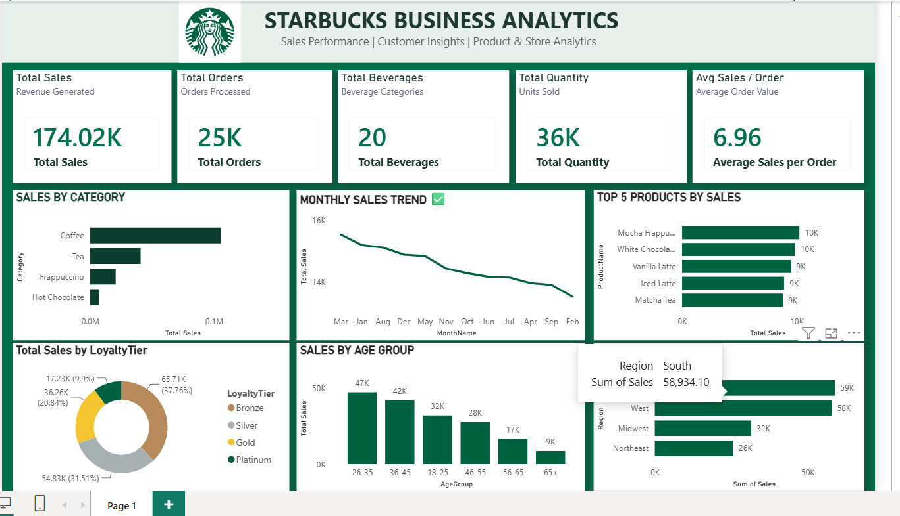

Interactive Starbucks Business Analytics Dashboard built using Power BI to analyze sales, customers, products, loyalty tiers, age groups, and regional performance.
# ☕ Starbucks Business Analytics Dashboard

## 📊 Project Overview

This project is an interactive Starbucks Business Analytics Dashboard created using Microsoft Power BI.

The dashboard provides insights into sales performance, customer behavior, product performance, loyalty tiers, age groups, and regional sales.

The main objective of this project is to transform raw business data into meaningful and interactive visual insights that can support data-driven decision making.

---

## 🎯 Business Objectives

- Analyze overall sales performance
- Understand customer purchasing behavior
- Identify top-performing beverage categories
- Analyze sales trends over time
- Compare customer loyalty tiers
- Understand sales contribution by age group
- Analyze regional sales performance
- Identify top-performing products
- Track important business KPIs

---

## 🛠️ Tools & Technologies

- Microsoft Power BI
- Power Query
- DAX
- Data Modeling
- Data Visualization
- Excel / CSV Dataset

---

## 📌 Key KPIs

The dashboard includes the following key performance indicators:

- Total Sales
- Total Orders
- Total Beverages
- Total Quantity
- Average Sales per Order

---
## 📌 Key Insights

- Coffee is the highest-selling beverage category.
- South and West regions contribute the highest sales.
- Customers aged 26–35 generate the highest sales.
- Bronze customers contribute the largest share of total sales.
- Mocha Frappuccino and White Chocolate Mocha are among the top-selling products.
- The dashboard helps identify monthly sales trends and customer purchasing patterns.
---
## 📈 Dashboard Insights

### Sales by Category
Coffee is the highest-performing beverage category, followed by Tea, Frappuccino, and Hot Chocolate.

### Monthly Sales Trend
The monthly sales trend helps identify changes in business performance across different months.

### Top 5 Products
The dashboard highlights the top-performing products based on total sales.

### Loyalty Tier Analysis
Sales are analyzed across Bronze, Silver, Gold, and Platinum customer loyalty tiers.

### Age Group Analysis
Customer sales performance is compared across different age groups.

### Regional Analysis
Sales performance is compared across different regions including South, West, Midwest, and Northeast.

---

## 📊 Dashboard Preview



---

## 🔄 Project Workflow

The project was developed using the following workflow:

1. Data Collection
2. Data Cleaning
3. Data Transformation using Power Query
4. Data Modeling
5. Creation of DAX Measures
6. KPI Development
7. Dashboard Design
8. Data Visualization
9. Business Insights

---

## 🧮 DAX Measures

Some of the important measures used in the dashboard include:

```DAX
## 🧮 DAX Measures

The dashboard uses DAX measures to calculate key business KPIs such as:

- Total Sales
- Total Orders
- Total Beverages
- Total Quantity
- Average Sales per Order

🎨 Dashboard Design

The dashboard follows a Starbucks-inspired visual theme using:

Starbucks Green
Light Green
White
Dark Green
Minimal and clean visual design

The dashboard contains:

KPI Cards
Bar Charts
Line Chart
Donut Chart
Product Analysis
Age Group Analysis
Regional Analysis


💡 Business Value

This dashboard can help business stakeholders:

Monitor sales performance
Identify high-performing products
Understand customer segments
Analyze regional performance
Track customer loyalty behavior
Identify sales trends
Make data-driven business decisions

🚀 Future Improvements

Future versions of this project can include:

Interactive slicers
Date filters
Store-level analysis
Customer-level analysis
Profitability analysis
Forecasting
Advanced customer segmentation

👨‍💻 Author

Rahul Raigar

Aspiring Data Analyst | Power BI | SQL | Excel | Data Visualization

